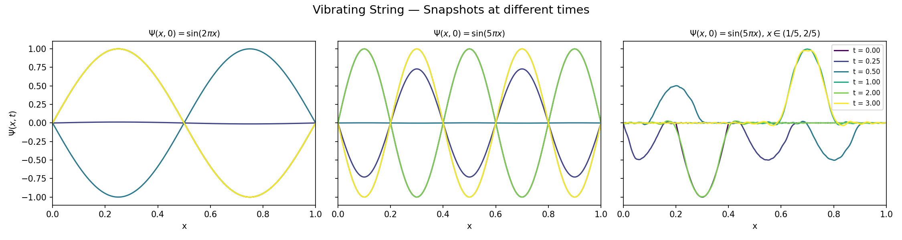
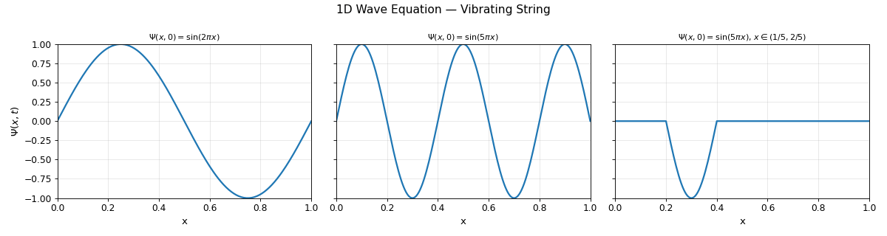
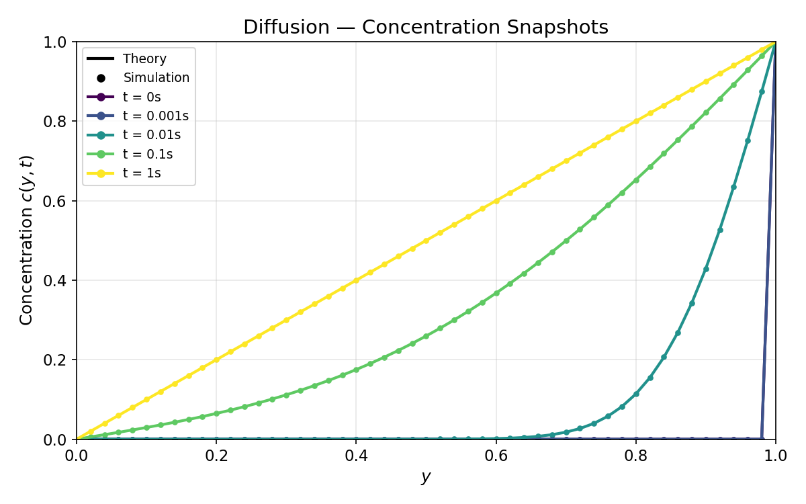
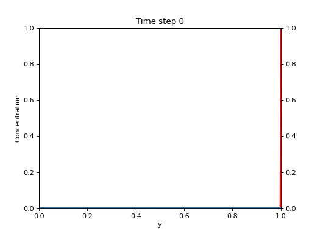

# SC-assignments

Numerical PDE solvers for the 2026 Scientific Computing course.
Three independent simulation pipelines — wave equation, Laplace equation, diffusion equation — each implemented in C++ with Python visualisation.

---

## How to run

```bash
make all          # build every C++ binary, run all simulations, generate all plots
make wave         # wave equation pipeline only
make laplace      # Laplace equation pipeline only
make diffusion    # diffusion equation pipeline only
make clean        # remove binaries and output/*.txt
```

Python-only simulations (not wired into the Makefile):

```bash
python3 main.py                     # projectile motion animation
python3 src/iterative_methods.py    # Gauss-Seidel & SOR solvers
python3 scripts/vibrating_string.py # Python wave equation solver
```

---

## Repository structure

```
.
├── src/
│   ├── main.cpp / fd1d_wave.{cpp,hpp}       # C++ 1-D wave solver
│   ├── laplace_main.cpp / laplace.{cpp,hpp} # C++ Laplace / Jacobi+SOR solver (OpenMP)
│   ├── main_fd_diffusion.cpp / fd_diffusion.{cpp,hpp} # C++ diffusion solver (OpenMP)
│   ├── wave_equation.py                     # Python finite-difference wave solver
│   ├── iterative_methods.py                 # Gauss-Seidel & SOR with Numba JIT
│   └── animation.py                         # projectile motion animation
├── scripts/
│   ├── plot_cpp_wave.py    # visualise wave output → snapshots + animation
│   ├── plot_laplace.py     # visualise Laplace output + run Python solvers
│   ├── fd_diffusion.py     # visualise diffusion output → snapshots + animation
│   └── vibrating_string.py # driver for the Python wave solver
├── output/                 # C++ simulation data (*.txt) and saved plots (plots/)
├── Makefile
└── requirements.txt
```

### C++ solvers (`src/`)

| Module | Equation | Method | Parallelism |
|---|---|---|---|
| `fd1d_wave` | 1-D wave | Finite difference (explicit) | — |
| `laplace` | Laplace (2-D) | Jacobi / SOR | OpenMP |
| `fd_diffusion` | 2-D diffusion | Finite difference (explicit) | OpenMP |

Each module writes text data to `output/`; the corresponding Python script reads it and produces plots under `output/plots/`.

### Python solvers (`src/`)

| File | Description |
|---|---|
| `iterative_methods.py` | Gauss-Seidel and SOR on the same Laplace problem, with Numba JIT and convergence analysis |
| `wave_equation.py` | NumPy finite-difference 1-D wave solver with matplotlib animation |

---

## Animations

### 1-D Wave equation (C++ solver) — three initial conditions





---

### Diffusion equation — concentration along the mid-column

Snapshots at early / mid / late time:





---

## Contributors

| Author | Commits |
|---|---|
| Lorenzo | 19 |
| pentolame | 8 |
| zzzimtzoe | 3 |
