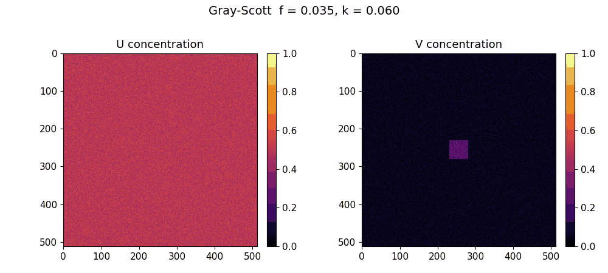
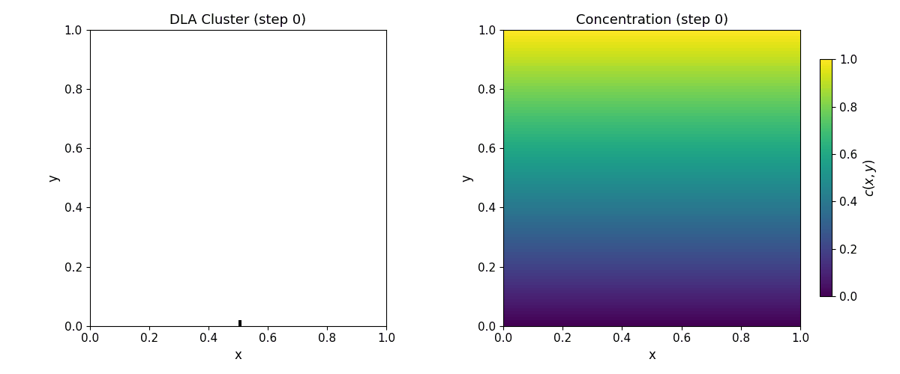
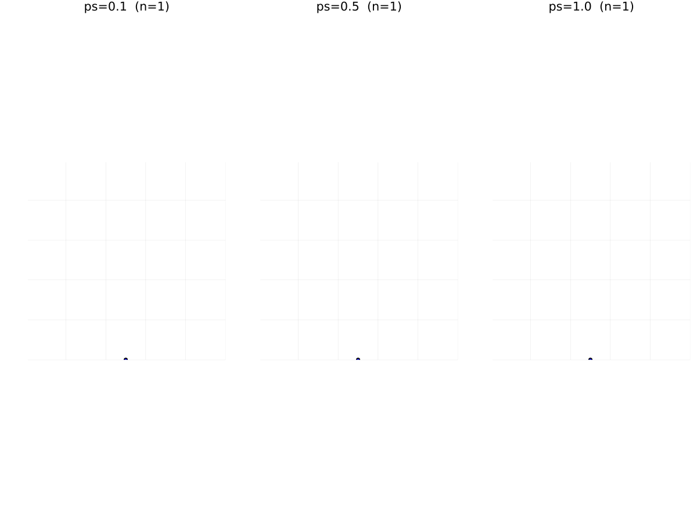
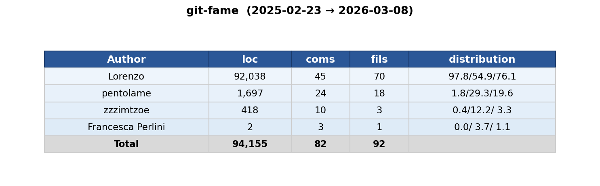

# Assignment 2

Gray-Scott reaction-diffusion and Diffusion-Limited Aggregation (DLA) simulations for the 2026 Scientific Computing course.
Two independent pipelines — Gray-Scott pattern formation and DLA cluster growth — each implemented in C++ with Python visualisation.

---

## How to run

```bash
make all              # build DLA binary, run simulation, generate plots, run CG comparison
make build            # compile the DLA binary only
make run              # run DLA simulation
make plot             # generate DLA plots
make gray_scott       # compile, run 11 Gray-Scott parameter combinations, generate plots
make cg               # CG vs SOR comparison benchmark + plots
make sweep            # η × ω parameter sweep benchmark + LaTeX tables
make eta              # η parameter investigation + plots
make scaling          # grid-size scaling benchmark + plots
make clean            # remove binaries and output data

# single Gray-Scott simulation
make gray_scott_cpp              # compile only
./gray_scott_cpp                 # default parameters (f=0.035, k=0.057)
./gray_scott_cpp 0.014 0.040     # custom f and k rates
python3 scripts/gray_scott_plot.py   # generate comparison plots
```

---

## Repository structure

```
.
├── src/
│   ├── main_gray_scott.cpp / gray_scott.{cpp,hpp}     # Gray-Scott reaction-diffusion simulator
│   ├── main_dla.cpp / library.hpp                      # DLA cluster growth simulator
│   ├── main_cg_compare.cpp / cg.cpp                    # CG vs SOR solver comparison
│   ├── main_scaling.cpp                                # Grid-size scaling benchmark
│   ├── sweep_main.cpp / rb_gauss_seidel.cpp / sor.cpp  # Parameter sweep & solvers
│   ├── dla_monte_carlo.py                              # Python DLA (Monte Carlo)
│   └── monte_carlo_dla.jl                              # Julia DLA
├── scripts/
│   ├── gray_scott_plot.py      # comparison plots (2×3 grids) & MP4 animations
│   ├── plot_dla.py             # DLA cluster & concentration visualisation
│   ├── plot_cg_compare.py      # CG vs SOR convergence & timing plots
│   ├── plot_eta.py             # η parameter effect on DLA morphology
│   ├── plot_scaling.py         # grid-size scaling benchmark plots
│   └── generate_tables.py      # LaTeX table generation from sweep results
├── docs/
│   ├── reference.md            # DLA theory & p_g / η parameter explanation
│   └── optimization.md         # solver optimisation notes & references
├── output/                     # simulation data (*.txt), plots (plots/)
├── Makefile
├── requirements.txt
└── pyproject.toml
```

### C++ solvers (`src/`)

| Module | Model | Method | Parallelism |
|---|---|---|---|
| `gray_scott` | Gray-Scott reaction-diffusion | Operator splitting (implicit reaction + FD diffusion) | — |
| `main_dla` / `sor` | DLA cluster growth | SOR on Laplace equation + stochastic growth | OpenMP |
| `cg` | Laplace (2-D) | Conjugate Gradient | — |
| `rb_gauss_seidel` | Laplace (2-D) | Red-Black Gauss-Seidel | OpenMP |

### Python / Julia solvers (`src/`)

| File | Description |
|---|---|
| `dla_monte_carlo.py` | Monte Carlo DLA in Python |
| `monte_carlo_dla.jl` | Monte Carlo DLA in Julia |

---

## Animations

### Gray-Scott Reaction-Diffusion

<table>
  <tr>
    <td align="center"><strong>ε pattern</strong> — <code>f=0.014, k=0.040</code></td>
    <td align="center"><strong>α / ξ pattern</strong> — <code>f=0.014, k=0.042</code></td>
  </tr>
  <tr>
    <td></td>
    <td></td>
  </tr>
  <tr>
    <td align="center"><strong>θ pattern</strong> — <code>f=0.022, k=0.051</code></td>
    <td align="center"><strong>stripe pattern</strong> — <code>f=0.025, k=0.051</code></td>
  </tr>
  <tr>
    <td></td>
    <td></td>
  </tr>
  <tr>
    <td align="center"><strong>δ pattern</strong> — <code>f=0.035, k=0.057</code></td>
    <td align="center"><strong>κ pattern</strong> — <code>f=0.035, k=0.060</code></td>
  </tr>
  <tr>
    <td></td>
    <td></td>
  </tr>
</table>

### DLA Cluster Growth

<table>
  <tr>
    <td align="center"><strong>SOR-based DLA</strong></td>
    <td align="center"><strong>CG-based DLA</strong></td>
  </tr>
  <tr>
    <td></td>
    <td></td>
  </tr>
  <tr>
    <td align="center" colspan="2"><strong>DLA cluster evolution</strong></td>
  </tr>
  <tr>
    <td align="center" colspan="2"></td>
  </tr>
</table>

---

## Dependencies

- **C++20** compiler (g++-15 or g++)
- **OpenMP** (parallelism for DLA solvers)
- **Eigen3** (header-only linear algebra)
- **Python ≥ 3.12** with packages: `numpy`, `matplotlib`, `scipy`, `scikit-learn`, `numba`, `findiff`
- **ffmpeg** (for MP4 animation export)

Install Python dependencies:

```bash
pip install -r requirements.txt
```

---

## Contributors


