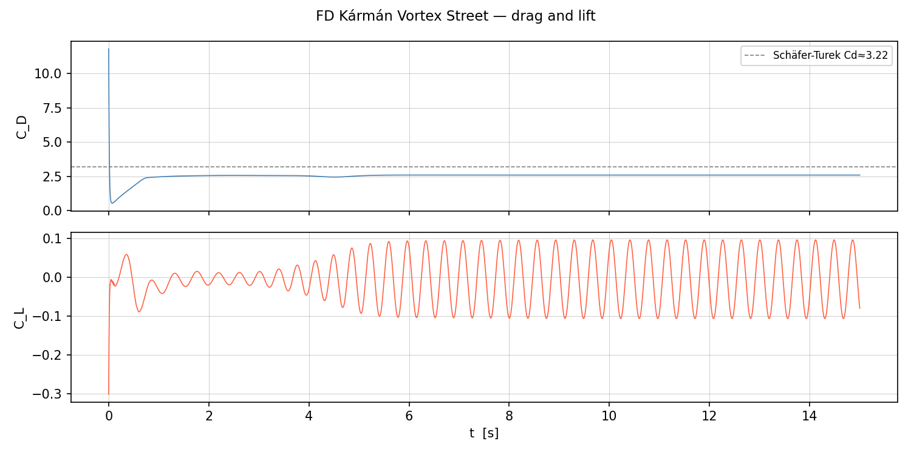

# Assignment 3

Three independent Navier-Stokes solvers for the Schäfer-Turek benchmark (Kármán vortex street, Re 100–3000) and a WiFi signal optimisation problem using the 2D Helmholtz equation.

<video src="karman.mp4" autoplay loop muted width="700"></video>

> Vorticity field from the LBM solver at Re = 400. Generated with `uv run python taichi_lbm.py 0`.

---

## Solvers at a glance

| Solver | Method | Language | Re range | Output |
|---|---|---|---|---|
| `taichi_lbm.py` | D2Q9 LBM | Python / Taichi (GPU) | up to ~3000 | interactive GUI |
| `vortex.py` | Taylor-Hood FEM | Python / NGSolve | up to ~400 | VTK + CSV + plots |
| `fd_ns/` | MAC staggered FD | C++20 / OpenMP | up to ~3000 | CSV + point-cloud txt |
| `wifi_problem/` | Helmholtz FD | Julia | — | CSV + PNG heatmap |

---

## Quick start

Install Python dependencies:

```bash
uv sync
```

The FD solver also needs Eigen3 and a C++20 compiler:

```bash
brew install eigen          # macOS
sudo apt install libeigen3-dev g++   # Debian/Ubuntu
```

---

## How to run

### LBM solver — GPU-accelerated, interactive

```bash
# Kármán vortex street — default Re = 400
uv run python taichi_lbm.py 0

# Custom Reynolds number
uv run python taichi_lbm.py 0 200

# Lid-driven cavity — Re = 1000
uv run python taichi_lbm.py 1
```

Press `ESC` or close the window to exit. Taichi auto-selects CUDA / Metal / Vulkan.

---

### FEM solver — NGSolve, headless

```bash
# Default: Re = 100, dt = 0.0005, tend = 8.0
uv run python vortex.py

# Custom parameters
uv run python vortex.py --Re 200 --dt 0.0005 --tend 8.0 --order 2 --maxh 0.07
uv run python vortex.py --help   # full option list
```

Output written to `karman_output/`. Open in ParaView:

```bash
paraview karman_output/karman.pvd
```

---

### FD solver — C++20, headless

```bash
cd fd_ns
make                                          # builds fd_karman
make test                                     # builds and runs unit tests

./fd_karman --Re 100 --tend 20.0             # benchmark run
./fd_karman --Re 1000 --nx 880 --ny 164      # high-Re on refined grid
```

Output written to `fd_ns/output/`. Visualise:

```bash
# Drag / lift time series
uv run python fd_ns/plot_fd.py forces

# Vorticity snapshot
uv run python fd_ns/plot_fd.py vorticity fd_ns/output/vorticity_010000.txt

# Animated vorticity (requires ffmpeg)
uv run python fd_ns/plot_fd.py animate --save karman.mp4
```



| Option | Default | Description |
|---|---|---|
| `--Re` | 100 | Reynolds number |
| `--nx` | 440 | Grid cells in x |
| `--ny` | 82 | Grid cells in y |
| `--dt` | 0.001 | Time step (s) |
| `--tend` | 20.0 | End time (s) |

See [`fd_ns/README.md`](fd_ns/README.md) for full theory, derivation, and benchmark results.

---

### WiFi / Helmholtz solver — Julia

Solves ∇²E + k²n²E = S on a 10 × 8 m floor plan to find the optimal router placement.

```bash
# Standalone single-file solver (1.2 GHz) — plots signal map
julia helmholtz.jl

# Exhaustive coarse grid search → wifi_problem/output/coarse_scores.csv
julia wifi_problem/scripts/evaluate_coarse_grid.jl

# Simulated annealing optimisation (2.4 GHz)
julia wifi_problem/scripts/optimize_placement.jl

# Visualise coarse grid heatmap
uv run python wifi_problem/scripts/plot_coarse_heatmap.py
```

---

## Repository structure

```
.
├── taichi_lbm.py           # D2Q9 LBM solver — GPU via Taichi, interactive
├── vortex.py               # Taylor-Hood FEM solver — NGSolve, headless
├── helmholtz.jl            # Standalone WiFi Helmholtz solver (single-file)
├── karman.mp4              # Vorticity animation (LBM, Re = 400)
├── forces.png              # Drag/lift time series (FD solver, Re = 400)
├── fd_ns/
│   ├── Makefile
│   ├── README.md           # Theory, derivation, CLI docs, benchmark results
│   ├── src/                # C++ source (MAC grid, BC, SOR Poisson, AB2)
│   └── output/             # drag_lift.csv, vorticity_*.txt (gitignored)
├── wifi_problem/
│   ├── src/helmholtz.jl    # Shared solver library
│   ├── scripts/            # Grid search, annealing, Python heatmap plotter
│   └── output/             # CSV results (gitignored)
├── data/
│   └── ghia1982.dat        # Ghia et al. (1982) lid-driven cavity reference data
├── docs/
│   ├── supg_theory.md      # SUPG stabilisation theory (FEM at high Re)
│   └── reference.md        # Upstream Taichi LBM README / LBM background
├── pyproject.toml
└── uv.lock
```

---

## Dependencies

**Python** (managed by [uv](https://github.com/astral-sh/uv)):

| Package | Purpose |
|---|---|
| `taichi ≥ 1.7.4` | GPU kernel compilation (CUDA / Metal / Vulkan) |
| `ngsolve ≥ 6.2` | Finite element framework |
| `matplotlib ≥ 3.10` | Plotting |

**C++ / system:**

- GCC ≥ 10 or Clang with C++20 support
- Eigen3 (`brew install eigen` / `apt install libeigen3-dev`)
- OpenMP (bundled with GCC; on macOS via `brew install gcc`)

**Julia** (not managed by uv — install from [julialang.org](https://julialang.org/downloads/)):

- Standard library only (`SparseArrays`, `LinearAlgebra`) plus `Plots.jl`

**ParaView** — to visualise `karman_output/*.pvd`. Install from [paraview.org](https://www.paraview.org/download/) or via `brew install paraview` / `apt install paraview`.

---

## Contributors

[](https://github.com/lorenzotecchia/SC-assignments)

### Contribution breakdown (2026-03-08 → 2026-03-29)

> Generated with `git-fame --since 2026-03-08 --until 2026-03-29`. Total: 46 commits, 6059 lines, 42 files.

| Author    |   loc |   commits |   files |  distribution (loc/commits/files) |
|:----------|------:|----------:|--------:|:----------------------------------|
| Lorenzo   |  3782 |        30 |      29 | 62.4% / 65.2% / 69.0%            |
| pentolame |  1887 |        11 |      10 | 31.1% / 23.9% / 23.8%            |
| zzzimtzoe |   390 |         5 |       3 |  6.4% / 10.9% /  7.1%            |
